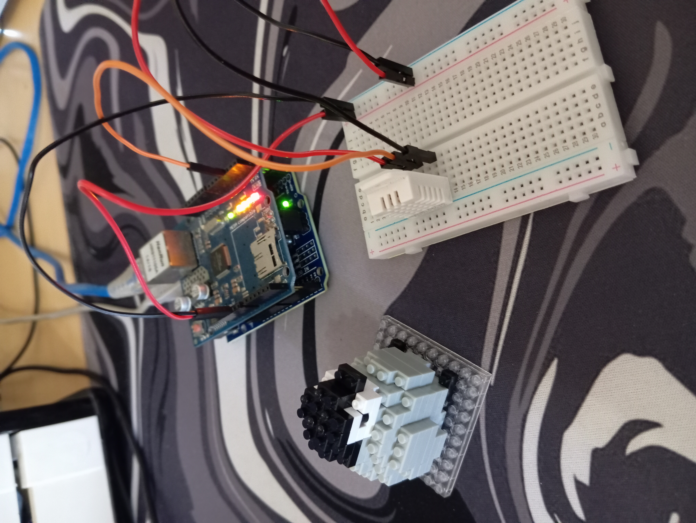
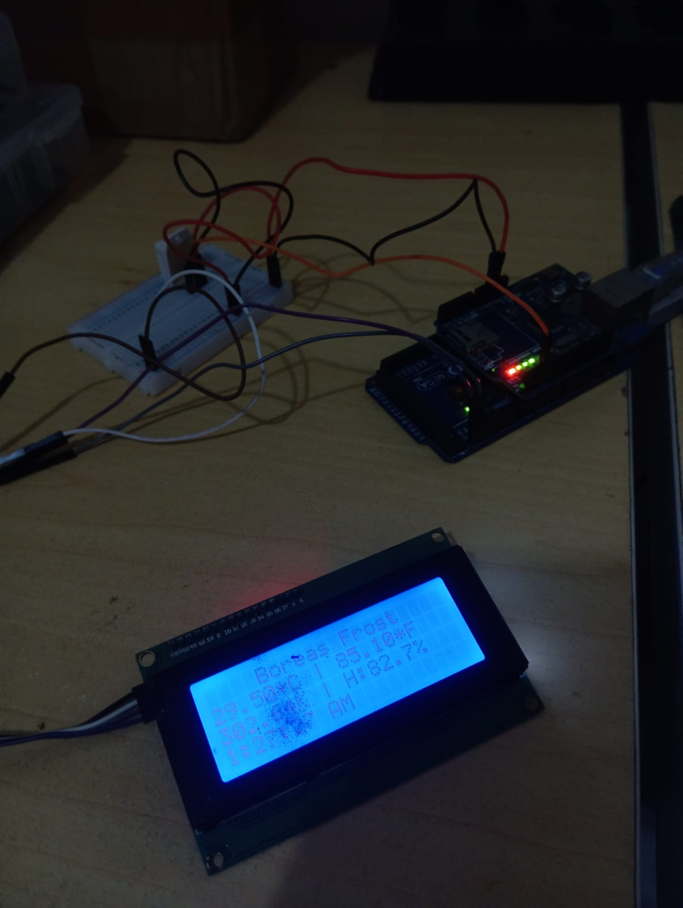
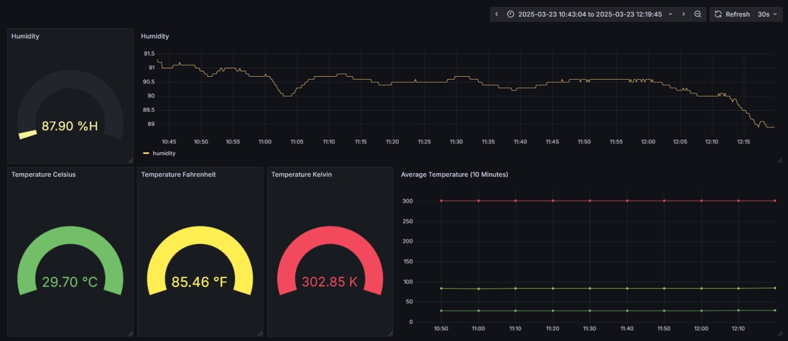

# Bóreas (Medidor de Temperatura e Umidade)
<div style="text-align: center;">
  
  <p style="font-style: italic; margin-top: 10px;">Figura 1: Representação artística de <b>Bóreas</b>, o Deus Grego dos ventos do norte.</p>
</div>

O **Bóreas** é um **projeto IoT** que utiliza um **Arduino** para medir **temperatura** e **umidade do ambiente** a partir do sensor **DHT22**. 

Os dados são enviados para um **broker MQTT (Mosquitto)** hospedado em um servidor Linux. O **Node-RED** atua como uma ponte de dados (**data bridge**), realizando a comunicação entre o **Mosquitto** e o banco de dados **InfluxDB**, onde os dados são armazenados. 

O **Grafana** consome os dados do **InfluxDB** para gerar um **dashboard** interativo e visualmente atraente. Além disso, o último dado aferido é exibido em um display **LCD 20x4** que está acoplado ao Arduino.

Todo o sistema é conteinerizado utilizando **Docker**, o que facilita a implantação e o gerenciamento dos serviços necessários, como **Mosquitto**, **Node-RED**, **InfluxDB** e **Grafana**.

<div style="text-align: center; margin-top: 20px;">
  
  <p style="font-style: italic; margin-top: 10px;">Figura 2: Diagrama do sistema IoT do projeto Bóreas.</p>
</div>

<div style="display: flex; justify-content: center; gap: 20px; margin-top: 20px;">
  <div style="text-align: center;">
    
    <p style="font-style: italic; margin-top: 10px;">Figura 3: Foto do projeto embarcado.</p>
  </div>
  <div style="text-align: center;">
    
    <p style="font-style: italic; margin-top: 10px;">Figura 4: Foto do Display LCD 20x4.</p>
  </div>
</div>

<div style="text-align: center; margin-top: 20px;">
  
  <p style="font-style: italic; margin-top: 10px;">Figura 5: Dashboard gerado no Grafana.</p>
</div>

*Este projeto foi desenvolvido durante a disciplina de **Fundamentos de Sistemas Embarcados**, ministrada pelo [Prof. Dr. Rodolfo Botto](https://buscatextual.cnpq.br/buscatextual/visualizacv.do;jsessionid=2708D44749FF71E24222D13D375F0255.buscatextual_0).*

## Componentes Necessários

## Softwares Necessários

## Estrutura do Projeto

## Configuração do Ambiente

Para iniciar os serviços necessários, como Mosquitto (broker MQTT), Node-RED e Grafana, utilize o comando abaixo:

```sh
docker-compose up --build -d
```